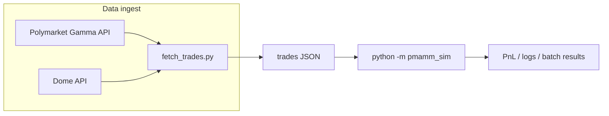

# pmamm-sim

**Polymarket AMM simulation** — replay historical prediction-market trades through a **constant-product liquidity pool** and measure how different **fee schedules** perform as a liquidity provider (LP).

This repo is a research / backtesting tool: it does not trade live capital or connect your wallet. It uses **public trade history** (via Polymarket metadata + the [Dome API](https://docs.domeapi.io)), normalizes fills into a single price sequence, then runs an offline simulation.

---

## What this repo does

1. **Ingest** — Resolve a Polymarket event/market, pull complete order history from Dome, and convert fills into a chronological list where each row reflects activity in **YES / USDC terms** (including sports-style outcomes by treating one outcome as “YES”).

2. **Collapse & load** — The simulator reads JSON trade lists. It groups fills by `tx_hash`, treats each transaction as one **fair-price observation** (see `pmamm_sim/data_loader.py`), and builds `MarketTrade` rows: timestamp, implied YES probability, and approximate USD size.

3. **Simulate** — For each historical “tick,” the model compares the pool’s **spot price** to that tick’s **fair price** (from the real market). A **rational arbitrageur** is assumed: they trade against the AMM only when, after fees, the trade is profitable. The AMM uses a **constant-product** curve in YES vs USDC; strategy code only controls **bid/ask fees** (and how they change over time), not the bonding curve family.

4. **Measure** — After replaying all trades and applying a binary **resolution** (`YES` vs `NO` wins), the engine reports **fee revenue**, **resolution PnL**, and **total return on initial liquidity**, optionally **versus a baseline fee strategy**.

So the core question being explored is: *given the same sequence of market-implied prices and sizes, how do different LP fee policies affect LP economics?*

---

## End-to-end pipeline



| Stage | Input | Output |
|--------|--------|--------|
| `fetch_trades.py` | Event URL or slug (`--market`, `--condition-id`, `--output-dir` optional) | `data/trades_<...>.json` by default |
| `python -m pmamm_sim …` | That JSON (or any compatible file) | Console summary; optional `--export` JSON |
| `batch` | Folder with `manifest.json` + per-market JSON files | Results under `--results-dir` |
| `serve` | Prior results + `visualizer.html` | Local HTTP UI |

The **simulator never calls Dome**; only `fetch_trades.py` needs a `DOME_API_KEY`.

---

## Simulation model (short)

- **AMM** — `ConstantProductAMM` maintains YES and USDC reserves with \(x \cdot y = k\). Spot implied probability is `reserve_y / reserve_x`. Initial reserves are set from **initial liquidity** and **starting YES probability** (default: infer from the first trade).

- **Fair price** — Each historical observation supplies `yes_price`; that is the signal the external “market” believes is fair at that instant.

- **Execution** — For each signal, the engine asks whether an arbitrage trade exists at the **strategy’s current fee** (`compute_arb_trade`). If the pool is already inside the **no-arbitrage band**, no trade occurs (*skipped* signal). Otherwise the pool executes the profit-maximizing size against the curve.

- **Strategies** — Implement `before_swap` / `after_swap` hooks (see `pmamm_sim/strategies.py`). Built-in names include **`fixed`**, **`time_decay`** (fees rise toward resolution), **`volatility`**, **`combined`**, **`ewma_momentum`**, plus a registry of fixed fee levels for sweeps. CLI **`--test-strategy`** picks the candidate; **`--baseline-fee`** configures the comparison baseline (bps).

- **PnL** — `PnLTracker` + `compute_final` separate **fees collected**, **mark-to-market** effects, and the **binary payout** when the market resolves. Because strategies leave different residual YES vs USDC and fee inventories, **resolution PnL** can differ even when fee revenues look similar.

---

## Repository layout

| Path | Role |
|------|------|
| `fetch_trades.py` | CLI to resolve markets and download + normalize Dome orders |
| `pmamm_sim/amm.py` | Constant-product math and arb trade construction |
| `pmamm_sim/engine.py` | Replay loop, single run vs test-vs-baseline replay |
| `pmamm_sim/pnl.py` | Fee accounting and terminal valuation at resolution |
| `pmamm_sim/strategies.py` | Fee strategy classes and `STRATEGIES` registry |
| `pmamm_sim/data_loader.py` | JSON → `MarketTrade` list + metadata |
| `pmamm_sim/cli.py` | `pmamm_sim`, `batch`, `serve` entrypoints |
| `pmamm_sim/batch.py` | Manifest-driven multi-market sweeps |
| `data/` | Default market **`trades_*.json`** files plus `manifest.json` for batch |
| `visualizer.html` | Served by `pmamm_sim serve` for browsing results |

Keep market JSONs directly under **`data/`**, not the repo root. Freshly fetched dumps land in **`data/`** by default. Add any market you want included in batch runs to **`data/manifest.json`**. Run sims with `python -m pmamm_sim data/trades_<name>.json --outcome …`. Outcomes in the manifest must stay aligned with how each market resolved.

---

## Setup

Python 3.10+ recommended.

```bash
pip install -r requirements.txt
```

### Dome API key (`fetch_trades.py` only)

1. Copy the example env file and add your key:

   ```bash
   cp .env.example .env
   ```

2. Set `DOME_API_KEY` in `.env` (or export it in your shell).

Running **`python -m pmamm_sim`** only needs JSON files on disk — **no** `DOME_API_KEY`.

---

## Commands

### Fetch trades

```bash
python fetch_trades.py "https://polymarket.com/event/<slug>"
# Optional: python fetch_trades.py <slug> [--market <substring>] [--condition-id <0x…>] [-o DIR]
```

Writes `data/trades_<...>.json` by default so the repo root stays clean and new market files follow the same convention as the committed dataset. Override with `--output-dir` / `-o` if you want to write somewhere else. Add new datasets to `data/manifest.json` when you want them included in batch/visualizer runs.

Each trade row includes fields such as `timestamp`, `yes_price`, `usd_size`, and `tx_hash`.

### Single-market simulation

```bash
python -m pmamm_sim data/trades_<name>.json --outcome 0|1 [options]
```

Example (Khamenei market, outcome per `data/manifest.json`):

```bash
python -m pmamm_sim data/trades_khamenei-out-as-supreme-leader-of-iran-by-january-31.json --outcome 0
```

`--outcome` is **0** if NO wins, **1** if YES wins. Use `--help` for liquidity, strategy, export, and time-window flags.

### Batch + visualizer (intended workflow)

The normal way to use this repo is to run a **full batch sweep** over every market in `data/manifest.json`, then open the local visualizer. By default, batch runs every strategy in `STRATEGY_REGISTRY`.

```bash
rm -rf results
python -m pmamm_sim batch ./data --results-dir ./results
python -m pmamm_sim serve --port 8080
```

Then open:

```text
http://localhost:8080/visualizer.html
```

Use `--strategies "FixedFee(100bps)"` only when you intentionally want a faster filtered run for debugging. If you use it, the visualizer will only show that filtered set until you regenerate `results/` without the flag.

---

## Competition

Submit fee strategies and compete on the leaderboard. Strategies are ranked by average return on liquidity across all markets.

### Quick start

```bash
# CLI
python -m pmamm_sim compete ./submissions/

# Web UI
python -m pmamm_sim serve
# Open http://localhost:8080/compete.html
```

### Writing a strategy

Your strategy is a Python class with two methods:

```python
class Strategy:
    def __init__(self):
        # Called once per market, no arguments. Set up any state here.
        self.fee = 100 / 10_000  # 100 bps

    def before_swap(self, pending: PendingTrade) -> FeeQuote:
        # Set fees for this trade. Return FeeQuote(bid_fee, ask_fee).
        return FeeQuote(bid_fee=self.fee, ask_fee=self.fee)

    def after_swap(self, trade: TradeInfo | None) -> None:
        # Update state after a trade executes. trade is None if skipped.
        pass
```

### What your strategy sees

**`before_swap(pending)`** receives a `PendingTrade` with:

| Field | Type | Description |
|-------|------|-------------|
| `side` | `str` | `"buy_yes"` or `"sell_yes"` (trader's perspective) |
| `fair_price` | `float` | External market's fair value signal (0 to 1) |
| `current_spot` | `float` | AMM's spot price before this trade |
| `reserve_x` | `float` | Current YES reserves in the pool |
| `reserve_y` | `float` | Current USDC reserves in the pool |
| `timestamp` | `int` | Unix timestamp of this trade |
| `time_to_resolution` | `float` | Seconds until the market resolves |
| `normalized_time` | `float` | 0.0 (market open) to 1.0 (resolution) |

**`before_swap`** must return a `FeeQuote(bid_fee, ask_fee)` where fees are decimals (e.g. `0.01` = 1% = 100 bps).

**`after_swap(trade)`** receives a `TradeInfo` (or `None` if the trade was skipped because it fell inside the no-arbitrage band):

| Field | Type | Description |
|-------|------|-------------|
| `side` | `str` | `"buy_yes"` or `"sell_yes"` |
| `amount_x` | `float` | YES shares traded |
| `amount_y` | `float` | USDC traded |
| `fee_amount` | `float` | Fee collected (in input token units) |
| `timestamp` | `int` | Unix timestamp |
| `reserve_x` | `float` | Post-trade YES reserves |
| `reserve_y` | `float` | Post-trade USDC reserves |
| `time_to_resolution` | `float` | Seconds until resolution |
| `normalized_time` | `float` | 0.0 to 1.0 |
| `fair_price` | `float` | The fair value signal for this trade |
| `post_spot` | `float` | AMM spot price after the trade |
| `realized_price` | `float` | Actual execution price (amount_y / amount_x) |

### How it works

For each historical trade, a rational arbitrageur pushes the AMM toward the fair price but stops when the fee eats into profit. Higher fees create a wider **no-arbitrage band** — more trades get skipped, but each executed trade earns more fees. The tradeoff between fee revenue and skipped volume is what makes this interesting.

A fresh `Strategy()` instance is created for each market, so state resets between markets but persists across trades within one market.

### Allowed imports

Submissions are sandboxed. You may only import from:

- `math`, `statistics`, `collections`, `dataclasses`, `functools`, `itertools`
- `pmamm_sim.types` (`FeeQuote`, `PendingTrade`, `TradeInfo`)

Calls to `open`, `exec`, `eval`, `__import__` and access to dunder attributes like `__class__`, `__subclasses__` are blocked.

### Submission format

**Web UI**: Paste the class body at `http://localhost:8080/compete.html`.

**CLI**: Drop a `.py` file in `submissions/`. The class can be named `Strategy` or anything with `before_swap` and `after_swap` methods. Optional module-level metadata:

```python
STRATEGY_NAME = "MyStrategy"
AUTHOR = "Your Name"
DESCRIPTION = "One-line description"
```

See `submissions/_template.py` for a documented example.

---

## Further reading in code

- Normalization from Dome → YES/USDC: `fetch_trades.py` (`normalize_trade`, etc.).
- Why trades are grouped by `tx_hash` and volume is halved: docstring in `pmamm_sim/data_loader.py`.
- Full strategy list for batch sweeps: `STRATEGY_REGISTRY` in `pmamm_sim/strategies.py`.

For all CLI flags: `python -m pmamm_sim --help`, `python fetch_trades.py --help`.
