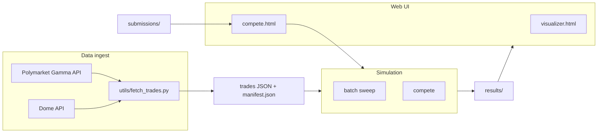

# pmamm-sim

**Polymarket AMM simulation** — replay historical prediction-market trades through a **constant-product liquidity pool** and measure how different **fee schedules** perform as a liquidity provider (LP).

This repo is a research / backtesting tool: it does not trade live capital or connect your wallet. It uses **public trade history** (via Polymarket metadata + the [Dome API](https://docs.domeapi.io)), normalizes fills into a single price sequence, then runs an offline simulation.

---

## What this repo does

1. **Ingest** — Resolve a Polymarket event/market, pull complete order history from Dome, and convert fills into a chronological list where each row reflects activity in **YES / NO terms** (including sports-style outcomes by treating one outcome as “YES”).

2. **Collapse & load** — The simulator reads JSON trade lists. It groups fills by `tx_hash`, treats each transaction as one **fair-price observation** (see `pmamm_sim/data_loader.py`), and builds `MarketTrade` rows: timestamp, implied YES probability, and approximate USD size.

3. **Simulate** — For each historical “tick,” the model compares the pool’s **spot price** to that tick’s **fair price** (from the real market). A **rational arbitrageur** is assumed: they trade against the AMM only when, after fees, the trade is profitable. The AMM uses a **constant-product** curve in YES vs NO; strategy code only controls **bid/ask fees** (and how they change over time), not the bonding curve family.

4. **Measure** — After replaying all trades and applying a binary **resolution** (`YES` vs `NO` wins), the engine reports **fee revenue**, **resolution PnL**, and **total return on initial liquidity**, optionally **versus a baseline fee strategy**.

So the core question being explored is: *given the same sequence of market-implied prices and sizes, how do different LP fee policies affect LP economics?*

---

## End-to-end pipeline



| Command | Input | Output |
|--------|--------|--------|
| `utils/fetch_trades.py` | Polymarket event URL or slug | `data/trades_<...>.json` |
| `batch` | `data/` folder with `manifest.json` + trade files | `results/` (per-strategy JSON + index) |
| `compete` | `submissions/` directory with strategy `.py` files | `results/` + leaderboard |
| `serve` | Results + HTML files | HTTP server: visualizer + competition UI + API |

The **simulator never calls Dome**; only `utils/fetch_trades.py` needs a `DOME_API_KEY`.

---

## Simulation model (short)

- **AMM** — `ConstantProductAMM` maintains YES and NO token reserves with \(yes \cdot no = k\). Spot implied probability is `reserve_no / (reserve_yes + reserve_no)`. Initial reserves are set from **initial liquidity** and **starting YES probability** (default: infer from the first trade). At resolution, the losing token goes to $0 and reserves are near-worthless (arbed away); LP returns come from **fees in the winning token**.

- **Fair price** — Each historical observation supplies `yes_price`; that is the signal the external “market” believes is fair at that instant.

- **Execution** — For each signal, the engine asks whether an arbitrage trade exists at the **strategy’s current fee** (`compute_arb_trade`). If the pool is already inside the **no-arbitrage band**, no trade occurs (*skipped* signal). Otherwise the pool executes the profit-maximizing size against the curve.

- **Strategies** — Implement `before_swap` / `after_swap` hooks (see `pmamm_sim/strategies.py`). Built-in names include **`fixed`**, **`time_decay`** (fees rise toward resolution), **`volatility`**, **`combined`**, **`ewma_momentum`**, plus a registry of fixed fee levels for sweeps. CLI **`--test-strategy`** picks the candidate; **`--baseline-fee`** configures the comparison baseline (bps).

- **PnL** — `PnLTracker` + `compute_final` separate **fees collected**, **mark-to-market** effects, and the **binary payout** when the market resolves. Because strategies leave different residual YES vs NO and fee inventories, **resolution PnL** can differ even when fee revenues look similar.

---

## Repository layout

| Path | Role |
|------|------|
| `utils/fetch_trades.py` | CLI to resolve markets and download + normalize Dome orders |
| `utils/bulk_fetch.py` | Bulk-fetch markets from a CSV and add to manifest |
| `pmamm_sim/amm.py` | Constant-product math and arb trade construction |
| `pmamm_sim/engine.py` | Replay loop, single run vs test-vs-baseline replay |
| `pmamm_sim/pnl.py` | Fee accounting and terminal valuation at resolution |
| `pmamm_sim/strategies.py` | Fee strategy classes and `STRATEGIES` registry |
| `pmamm_sim/types.py` | Core data types (`FeeQuote`, `PendingTrade`, `TradeInfo`, `SimResult`) |
| `pmamm_sim/data_loader.py` | JSON → `MarketTrade` list + metadata |
| `pmamm_sim/cli.py` | CLI entrypoints: single, batch, compete, serve |
| `pmamm_sim/batch.py` | Manifest-driven multi-market sweeps |
| `pmamm_sim/loader.py` | Dynamic discovery and validation of strategy submissions |
| `pmamm_sim/sandbox.py` | AST-based code safety checks for submissions |
| `pmamm_sim/server.py` | HTTP server with competition API routes |
| `data/` | Market **`trades_*.json`** files plus `manifest.json` for batch |
| `submissions/` | Strategy submission files (see `_template.py`) |
| `visualizer.html` | Strategy comparison dashboard (Chart.js) |
| `compete.html` | Competition submission UI with leaderboard |
| `COMPETE.md` | Guide for competitors |
| `DEPLOY.md` | Guide for deploying to AWS |

Keep market JSONs directly under **`data/`**, not the repo root. Freshly fetched dumps land in **`data/`** by default. Add any market you want included in batch runs to **`data/manifest.json`**. Run sims with `python -m pmamm_sim data/trades_<name>.json --outcome …`. Outcomes in the manifest must stay aligned with how each market resolved.

---

## Setup

Python 3.10+ recommended.

```bash
pip install -r requirements.txt
```

### Dome API key (`utils/fetch_trades.py` only)

1. Copy the example env file and add your key:

   ```bash
   cp .env.example .env
   ```

2. Set `DOME_API_KEY` in `.env` (or export it in your shell).

Running **`python -m pmamm_sim`** only needs JSON files on disk — **no** `DOME_API_KEY`.

---

## Commands

### Fetch trades

```bash
python utils/fetch_trades.py "https://polymarket.com/event/<slug>"
# Optional: python utils/fetch_trades.py <slug> [--market <substring>] [--condition-id <0x…>] [-o DIR]
```

Writes `data/trades_<...>.json` by default so the repo root stays clean and new market files follow the same convention as the committed dataset. Override with `--output-dir` / `-o` if you want to write somewhere else. Add new datasets to `data/manifest.json` when you want them included in batch/visualizer runs.

Each trade row includes fields such as `timestamp`, `yes_price`, `usd_size`, and `tx_hash`.

### Single-market simulation

```bash
python -m pmamm_sim data/trades_<name>.json --outcome 0|1 [options]
```

Example (Khamenei market, outcome per `data/manifest.json`):

```bash
python -m pmamm_sim data/trades_khamenei-out-as-supreme-leader-of-iran-by-january-31.json --outcome 0
```

`--outcome` is **0** if NO wins, **1** if YES wins. Use `--help` for liquidity, strategy, export, and time-window flags.

### Batch + visualizer (intended workflow)

The normal way to use this repo is to run a **full batch sweep** over every market in `data/manifest.json`, then open the local visualizer. By default, batch runs every strategy in `STRATEGY_REGISTRY`.

```bash
rm -rf results
python -m pmamm_sim batch ./data --results-dir ./results
python -m pmamm_sim serve --port 8080
```

Then open:

```text
http://localhost:8080/visualizer.html
```

Use `--strategies "FixedFee(100bps)"` only when you intentionally want a faster filtered run for debugging. If you use it, the visualizer will only show that filtered set until you regenerate `results/` without the flag.

---

## Competition

Submit fee strategies and compete on a leaderboard, ranked by a geometric-mean return score across all markets (with clipped per-market returns and a 5% market-average fill-rate activity gate).

```bash
# CLI
python -m pmamm_sim compete ./submissions/

# Web UI (also serves the visualizer)
python -m pmamm_sim serve
# Competition: http://localhost:8080/compete.html
# Visualizer:  http://localhost:8080/visualizer.html
```

Submissions are sandboxed — only safe stdlib modules and `pmamm_sim.types` can be imported. See `pmamm_sim/sandbox.py` for the allowlist.

### Competition API (async submit flow)

`POST /api/submit` is asynchronous and queues a run, returning:

```json
{
  "ok": true,
  "job_id": "<id>",
  "status": "queued",
  "queue_position": 1,
  "poll_after_ms": 1500
}
```

Poll `GET /api/jobs/<job_id>` until terminal state:

- `queued`
- `running`
- `succeeded` (includes final submission result + refreshed leaderboard payload)
- `failed`
- `timed_out` (execution exceeded 120 seconds)

The 120-second limit applies to execution time after a job starts running (not queue wait time).
Server-side job lifecycle events are appended to `results/job_events.jsonl` for debugging/audit trails.

**For competitors**: [COMPETE.md](COMPETE.md) — strategy interface, available data fields, baselines, ideas, and rules.

**For deployment**: [DEPLOY.md](DEPLOY.md) — hosting on AWS with a shareable URL via Cloudflare Tunnel.

---

## Further reading in code

- Normalization from Dome → YES/NO: `fetch_trades.py` (`normalize_trade`, etc.).
- Why trades are grouped by `tx_hash` and volume is halved: docstring in `pmamm_sim/data_loader.py`.
- Full strategy list for batch sweeps: `STRATEGY_REGISTRY` in `pmamm_sim/strategies.py`.

For all CLI flags: `python -m pmamm_sim --help`, `python utils/fetch_trades.py --help`.
